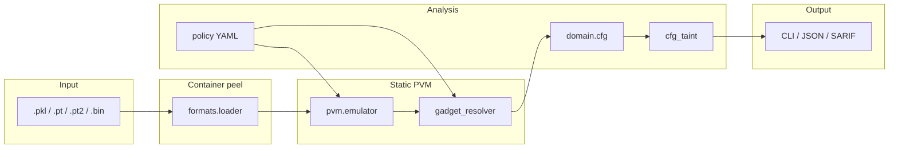

# PickleProbe

Static analyzer for Python pickle bytecode in ML supply-chain artifacts. Inspects serialized objects **without** calling `pickle.load()`, using `pickletools` disassembly plus a partial Pickle Virtual Machine (PVM) emulator.

> **GitHub:** [github.com/Phaneesh-Katti/pickleprobe](https://github.com/Phaneesh-Katti/pickleprobe) — *static pickle bytecode probe for ML artifact security*

Alternative names considered: **Brine** (pickle pun), **PVMScope** (technical). PickleProbe avoids collision with Fickling’s unrelated `polyglot` submodule.

## Quick demo

Malicious (`picklescan/malicious15b.pkl` — real HF scanner corpus):

```
Findings: 1 SUSPICIOUS invocation(s)
  WARN @131: bdb.Bdb.run(..., 'import os\nos.system("whoami")')
Memo warnings:
  - memo-fed STACK_GLOBAL at 37: bdb.Bdb (SUSPICIOUS)
```

Benign (`wolfpack-army/benign_model.pt`): no SINK/SUSPICIOUS invocations.

Full output: [docs/demo-output.txt](docs/demo-output.txt)

## Current scope

- **PVM emulation**: stack, memo, protocol 0–5 opcodes (`SETITEMS`/`APPENDS`, `EXT*`, `INST`/`OBJ`, …)
- **Security policy**: YAML rule pack (`src/pickleprobe/policy/default.yaml`) — [`--policy` flag](docs/SECURITY_POLICY.md)
- **Invocation analysis**: `GLOBAL`, `STACK_GLOBAL`, `REDUCE`, `BUILD`, `NEWOBJ`, multi-hop gadget folding
- **CFG + taint**: dataflow edges and exploit path reporting
- **Formats**: raw pickle, PyTorch `.pt` ZIP, `.bin`, `.pt2` byte streams
- **Memo checks**: GET-before-PUT, overwrite PUT, memo-fed `STACK_GLOBAL`

## vs the field

| Tool | Role | PickleProbe |
|------|------|-------------|
| [picklescan](https://github.com/mmaitre314/picklescan) | Production HF Hub scanner | — |
| [Fickling](https://github.com/trailofbits/fickling) | Decompile + sanitize | — |
| [PickleBall](https://github.com/columbia/pickleball) | Research policy enforcement | — |
| **PickleProbe** | Learn/teach bytecode + CFG + honest eval | **this repo** |

## Architecture



## Evaluation

**12 real-world samples** (8 malicious, 4 benign) from WolfpackArmy, Rodion111, and picklescan `tests/data` — see [tests/corpus/manifest.yaml](tests/corpus/manifest.yaml). No synthetic eval bytes.

| Scanner | Malicious detected | Benign false positives | Notes |
|---------|-------------------:|-----------------------:|-------|
| Naive `GLOBAL`-only | 4/8 | — | `pickletools` GLOBAL grep vs policy sinks |
| **PickleProbe** | **7/8** | **0/4** | PVM + `STACK_GLOBAL` / REDUCE / BUILD / multi-hop gadgets |

| Sample | Label | Naive | PP sinks | PP suspicious | Why it matters |
|--------|-------|:-----:|:--------:|:-------------:|----------------|
| `wolfpack-benign-model` | benign | · | 0 | 0 | PyTorch ZIP control |
| `wolfpack-benign-torchscript` | benign | · | 0 | 0 | TorchScript artifact |
| `wolfpack-mal-torchsave` | malicious | ✓ | 1 | 0 | `torch.save` → `eval` |
| `wolfpack-mal-statedict` | malicious | ✓ | 1 | 0 | evil `state_dict` in ZIP |
| `rodion-mal-pt2` | malicious | · | 1 | 0 | **STACK_GLOBAL** `.pt2` bypass |
| `pscan-benign-v4` | benign | · | 0 | 0 | picklescan benign ref |
| `pscan-benign-pytorch-bin` | benign | · | 0 | 0 | HF-style `pytorch_model.bin` |
| `pscan-mal-eval-chain` | malicious | ✓ | 2 | 2 | multi-stage eval chain |
| `pscan-mal-bdb-global` | malicious | · | 1 | 1 | debugger gadget (`bdb`) |
| `pscan-mal-bdb-stack-global` | malicious | · | 0 | 1 | **STACK_GLOBAL** evades GLOBAL grep |
| `pscan-mal-magic-bypass` | malicious | ✓ | 1 | 0 | PyTorch magic header |
| `pscan-mal-sys-override` | malicious | · | 0 | 0 | known gap — unresolved STACK_GLOBAL tail |

**PickleProbe-only** (naive missed): `rodion-mal-pt2`, `pscan-mal-bdb-global`, `pscan-mal-bdb-stack-global`.

**Known gap:** `pscan-mal-sys-override` — picklescan regression sample; PickleProbe emulates the stream but does not yet flag SINK/SUSPICIOUS (unresolved `STACK_GLOBAL` tail).

Regenerate after corpus changes:

```bash
./scripts/fetch_corpus.sh
python scripts/benchmark_corpus.py          # 12-sample manifest
python scripts/benchmark_pickleball_subset.py  # hand-picked PickleBall members
python scripts/benchmark_corpus.py --markdown  # paste into README
python scripts/compare_picklescan.py        # optional: pip install picklescan
```

### Batch scanning (archives stay compressed)

```bash
# Stream results as each member completes (recommended for PickleBall)
pickleprobe scan tests/corpus/archives/pickleball-malicious.tar.gz --progress --limit 10

# Summary table only; skip huge archive members (default: 64 MiB cap)
pickleprobe scan tests/corpus/archives --progress --max-member-mb 80

# One archive member
pickleprobe analyze tests/corpus/archives/pickleball-malicious.tar.gz \
  --member ours/call_system.pkl
```

For portfolio eval, prefer the **hand-picked subset** (`tests/corpus/pickleball_subset.yaml`, 8 samples) over full-archive scans — gzip tar sequential reads make all-336-model sweeps slow.

*Detection rules:* naive = any policy sink on `GLOBAL` opcode; PickleProbe = sink invocation or suspicious REDUCE chain on malicious samples (see `scripts/benchmark_corpus.py`). This is a **small, honest** benchmark — not PickleBall-scale.

## Non-goals

- Not production-ready — no sanitization or Hugging Face Hub integration
- Partial PVM — some opcodes/layouts approximate stack only
- Small real corpus (~12 KB) — not full PickleBall 336-model sweep
- Static analysis only — findings are advisory

See [docs/DESIGN.md](docs/DESIGN.md) for architecture and an exploit walkthrough.

## Setup

```bash
python3 -m venv .venv
source .venv/bin/activate
pip install -e ".[dev]"
```

If you still use the existing `polyglot/` venv from earlier setup:

```bash
source polyglot/bin/activate
pip install -e ".[dev]"
```

## Usage

The `pickleprobe` command is installed **inside your venv**, not globally. Either activate the venv first, or call the venv binary directly:

```bash
# after: source .venv/bin/activate  (or source polyglot/bin/activate)
pickleprobe analyze path/to/suspicious.pkl
pickleprobe analyze path/to/model.pt --json
pickleprobe analyze model.pt --policy custom.yaml
pickleprobe analyze model.pt --sarif          # SARIF 2.1.0 for CI
pickleprobe scan tests/corpus/samples -r      # batch directory scan

# without activating the venv:
./.venv/bin/pickleprobe analyze tests/corpus/samples/picklescan/malicious15b.pkl
# or (legacy venv folder name):
./polyglot/bin/pickleprobe analyze tests/corpus/samples/picklescan/malicious15b.pkl
```

Exit codes (for scripts/CI — **not** crash indicators):

| Code | Meaning |
|------|---------|
| `0` | Clean — no SINK or SUSPICIOUS invocations |
| `1` | Suspicious/inconclusive findings |
| `2` | SINK detected (critical) |

A malicious sample like `malicious15b.pkl` exits `1` on purpose after printing findings. Your shell may show “command failed”; that is the verdict, not a broken run.

### Library API

```python
from pickleprobe.analysis.analyzer import PickleAnalyzer

report = PickleAnalyzer(policy_path="custom.yaml").analyze_file("model.pt").primary
print(report.sink_invocations, report.exploit_paths)
```

## Evaluation corpus

**Real datasets only** — WolfpackArmy HF, Rodion111 PoC, picklescan reference tests. No synthetic eval bytes. Summary table: [Evaluation](#evaluation) above.

```bash
./scripts/fetch_corpus.sh          # ~12 KB, 12 files
python scripts/benchmark_corpus.py
python scripts/compare_picklescan.py   # needs: pip install picklescan
```

See [tests/corpus/README.md](tests/corpus/README.md). Optional full PickleBall: `./scripts/download_corpus.sh`.

## Tests & CI

```bash
pytest -q
```

GitHub Actions runs `pytest` + `benchmark_corpus.py` on Python 3.10 and 3.12.

## Project layout

```
src/pickleprobe/
  domain/       Values, CFG, security policy
  policy/       default.yaml rule pack
  pvm/          Pickle VM emulator
  analysis/     Analyzer, CFG taint
  formats/      PyTorch ZIP / raw pickle loading
  cli.py        CLI entry point
tests/corpus/   Real samples + manifest.yaml
docs/           DESIGN.md, SECURITY_POLICY.md, COMPARISON.md
```
